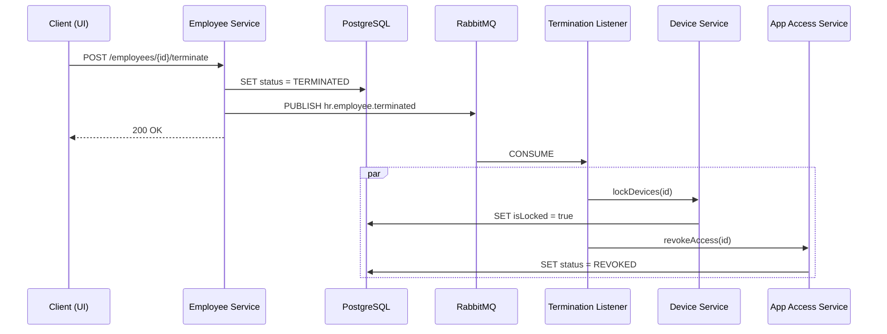

#  Hive Engine

An event-driven employee offboarding platform. When HR terminates an employee, the system automatically locks their devices and revokes application access -- all through asynchronous message processing via RabbitMQ.

Includes a React dashboard with HR and Employee views. HR manages people, devices, and app access. Employees see their own credentials and access status. Termination effects propagate to the Employee view in real time.

## Architecture



A single termination triggers independent side effects. The producer (EmployeeService) doesn't know or care about the consumers -- new reactions can be added without modifying existing code.

## Tech Stack

**Backend:** Java 21, Spring Boot 3.3, Spring Data JPA, Spring AMQP, Lombok, Maven

**Frontend:** React 18, TypeScript, Vite, React Router, TanStack React Query, Lucide Icons

**Infrastructure:** PostgreSQL 16, RabbitMQ 3.13, Docker Compose

## Getting Started

### Prerequisites

- Java 21
- Docker Desktop
- Node.js 18+

### 1. Clone and start infrastructure

```bash
git clone https://github.com/carsonjc04/Hive-Engine.git
cd Hive-Engine
docker compose up -d
```

This starts PostgreSQL (port 5432) and RabbitMQ (port 5672, management UI at 15672).

### 2. Start the backend

```bash
./run.sh
```

This sets `JAVA_HOME` to Java 21 and runs `mvnw spring-boot:run`. The API starts on `http://localhost:8080`.

If you prefer to run manually:

```bash
export JAVA_HOME=$(/usr/libexec/java_home -v 21)
./mvnw spring-boot:run
```

### 3. Start the frontend

```bash
cd frontend
npm install
npm run dev
```

Open `http://localhost:5173`. The dashboard starts in HR mode.

## Usage

### HR Dashboard

- **People** -- Add employees, view their profiles, terminate them
- **Devices** -- See all managed devices and their lock status
- **Apps** -- See all application access records

From an employee's detail page, assign devices and app access. Click **Terminate** to fire the event -- devices lock and apps revoke automatically.

### Employee View

Click **Switch to Employee View** in the sidebar and select an employee. This view shows:

- **My Dashboard** -- Status overview, assigned apps and devices
- **My Apps** -- Application access with mock credentials (passwords hidden behind a toggle)
- **My Devices** -- Assigned hardware with status

When HR terminates the employee, the Employee view updates within seconds -- apps show REVOKED, devices show LOCKED, and a termination banner appears.

## API Reference

| Method | Endpoint | Description |
|--------|----------|-------------|
| GET | `/api/employees` | List all employees |
| GET | `/api/employees/{id}` | Get employee by ID |
| POST | `/api/employees` | Create employee |
| POST | `/api/employees/{id}/terminate` | Terminate employee |
| GET | `/api/devices` | List all devices |
| GET | `/api/devices/employee/{id}` | Devices by employee |
| POST | `/api/devices` | Assign device |
| GET | `/api/app-access` | List all app access |
| GET | `/api/app-access/employee/{id}` | App access by employee |
| POST | `/api/app-access` | Grant app access |

## Testing (curl)

```bash
# Create employee
curl -X POST http://localhost:8080/api/employees \
  -H "Content-Type: application/json" \
  -d '{"fullName": "Jane Doe", "email": "jane@company.com", "department": "Engineering"}'

# Assign a device (replace 1 with employee ID)
curl -X POST http://localhost:8080/api/devices \
  -H "Content-Type: application/json" \
  -d '{"employeeId": 1, "deviceType": "LAPTOP", "serialNumber": "SN-001"}'

# Grant app access
curl -X POST http://localhost:8080/api/app-access \
  -H "Content-Type: application/json" \
  -d '{"employeeId": 1, "appName": "Slack", "role": "Member"}'

# Terminate -- locks device, revokes Slack
curl -X POST http://localhost:8080/api/employees/1/terminate
```

## Project Structure

```
src/main/java/com/carsonchristensen/hive/
├── config/          RabbitMQ + CORS configuration
├── controller/      REST controllers (Employee, Device, AppAccess)
├── event/           Event publishing (EmployeeEvent, EventPublisher)
├── listener/        Event consumers (TerminationEventListener)
├── model/           JPA entities and enums
├── repository/      Spring Data repositories
└── service/         Business logic

frontend/src/
├── api/             Typed API client
├── components/      Layout, EmployeePicker
├── context/         Role switching context
├── hooks/           Toast notifications
└── pages/           Dashboard, People, Devices, Apps, Employee views
```
