# Hive Engine

Hi Programmers!

This is my Hive Engine, a reactive backend system designed to automate IT and HR offboarding workflows. Built with an Event-Driven Architecture, it decouples the "Trigger" (Employee Termination) from the "Reactions" (Device Locking, App Access Revocation), ensuring scalability and resilience. Having these two processes separate improves security concerns and safe removal of former employee's access rights to secure company data.

## Architecture

The System follows a Producer-Consumer pattern using RabbitMQ as the message broker.

- **Core:** Spring Boot 3.3 (Java 21)
- **Database:** PostgreSQL 16 (Dockerized)
- **Messaging:** RabbitMQ 3.13 (Dockerized)
- **Testing:** JUnit 5 + Testcontainers

### Event-Driven Workflow

```mermaid
sequenceDiagram
    participant Client as 👤 Client (Curl/UI)
    participant API as ⚙️ Employee Service
    participant DB as 🗄️ Database
    participant MQ as 🐇 RabbitMQ
    participant Listener as 👂 Termination Listener
    participant Device as 💻 Device Service
    participant App as 🔐 App Access Service

    Note over Client, API: 1. The Trigger
    Client->>API: POST /terminate (ID: 12)
    API->>DB: UPDATE Employee SET status='TERMINATED'
    API->>MQ: PUBLISH "hr.employee.terminated"
    API-->>Client: 200 OK (Immediate Return)

    Note over MQ, App: 2. The Async Reaction
    MQ->>Listener: CONSUME Message
    
    par Parallel Execution
        Listener->>Device: lockDevices(12)
        Device->>DB: UPDATE Device SET status='LOCKED'
        
        Listener->>App: revokeAccess(12)
        App->>DB: UPDATE AppAccess SET status='REVOKED'
    end
```



## Key Features

- **Recursive Workflow Engine:** A single termination event which would be done by HR would trigger a cascade of independent side effects.
- **Device Management:** Automatically locks hardware (Laptops, Phones) upon employee termination.
- **Identity Management:** Revokes access to third-party applications (Slack, Jira, Teams, Github) instantly.
- **Transactional Integrity:** Utilizes Spring `@Transactional` to ensure data consistency across services.

## Tech Stack

- **Language:** Java 21 (Records, Pattern Matching)
- **Framework:** Spring Boot 3 (Web, Data JPA, AMQP)
- **Infrastructure:** Docker & Docker Compose
- **Tools:** Lombok, Maven, Jackson

## Getting Started

### Prerequisites

- Java 21+
- Docker Desktop

### Installation

1. **Clone the repository**
   ```bash
   git clone https://github.com/yourusername/hive-engine.git
   cd hive-engine
   ```

2. **Start Infrastructure (Postgres & RabbitMQ)**
   ```bash
   docker-compose up -d
   ```

3. **Run the Application**
   ```bash
   ./mvnw spring-boot:run
   ```

## Manual Testing

### 1. Create an Employee

```bash
curl -X POST http://localhost:8080/api/employees \
  -H "Content-Type: application/json" \
  -d '{"fullName": "Carson Test", "email": "carson@hive.com", "department": "Engineering"}'
```

### 2. Provision Resources (Devices & Apps)

**Assign Laptop** (Replace `{id}` with the ID returned from step 1)

```bash
curl -X POST http://localhost:8080/api/devices \
  -H "Content-Type: application/json" \
  -d '{"employeeId": {id}, "deviceType": "LAPTOP", "serialNumber": "MBP-2024"}'
```

**Assign Slack Access**

```bash
curl -X POST http://localhost:8080/api/app-access \
  -H "Content-Type: application/json" \
  -d '{"employeeId": {id}, "appName": "Slack", "role": "Developer"}'
```

### 3. Trigger Termination

This API call triggers the RabbitMQ event, which automatically locks the device and revokes app access.

```bash
curl -X POST http://localhost:8080/api/employees/{id}/terminate
```
